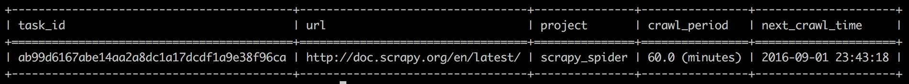
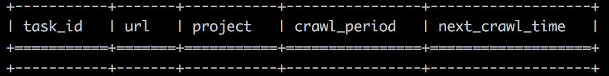

Crontab
=========

Start
------

If you want to run some tasks periodically or run tasks at the absolute time in the future,
you can use these parameters in ``self.crawl()``:

     ``crawl_at``:
        The absolute time to start the crawl. It must be a timestamp.
     ``crawl_later``:
        Starts the crawl after ``crawl_later`` seconds.
     ``crawl_period``:
        Schedules the request to be called periodically.
        The crawl is called every ``crawl_period`` seconds.

For example::

    from fulmar.base_spider import BaseSpider

    class Handler(BaseSpider):

        base_url = 'http://doc.scrapy.org/en/latest/'

        def on_start(self):
            self.crawl(Handler.base_url, callback=self.save, crawl_period=60*60)

        def save(self, response):
            return {
                'content': response.content,
                'title': response.page_lxml.xpath('//title/text()')[0]
            }

Now we save it to a file called ``scrapy_spider`` and run command::

                  fulmar start_project scrapy_spider.py

We satrtted a project called ``scrapy_spider`` and it will run every one hour.

It's convenient to see it by::

                  fulmar crontab

--help
-----------

You can get ``help``, just run:

``fulmar crontab --help``

You will see:

::

    Usage: fulmar crontab [OPTIONS]

      Crontab infos and operations.

    Options:
      -d, --delete TEXT  Delete a cron task. Here use taskid, e.g, -d taskid
      -v, --verbose      Verbose mode. Show more information about this crontab.
      --help             Show this message and exit.

--delete/-d
------------
Delete a cron task.
Here use taskid to represents a cron task.
You can delete a task which you put just now::

    fulmar crontab --delete=ab99d6167abe14aa2a8dc1a17dcdf1a9e38f96ca

Now if you run ``fulmar crontab``, you will see:

The task has been deleted successfully.

--vorbose/-v
-------------

Verbose mode. Show more information about this crontab.

