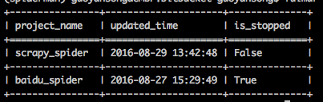

Project
=======

**Note:**  `Redis` is necessary, so make sure you have installed it.

start_project
-------------

.. code-block:: python

   from fulmar.base_spider import BaseSpider

   class Handler(BaseSpider):

      def on_start(self):
         self.crawl('http://www.baidu.com/', callback=self.detail_page)

      def parse_and_save(self, response):
         return {
            "url": response.url,
            "title": response.page_lxml.xpath('//title/text()')[0]}

You can save above code in a new file called   ``baidu_spider.py``   and run command in a new console::

                  fulmar start_project baidu_spider.py

you will get::

                  Successfully start the project, project name: `baidu_spider`.

Now we create a new project called ``baidu_spider`` and start it.

As you can see, project name is from the script file name. So you should kee the file
name unique.

**Note:** In fact ``start_project`` just put a new task into new task queue.
So, If your fulmar service is not running, this project will not start until you start fulmar.

stop_project
------------

Run command::

                  fulmar stop_project baidu_spider.py

you will get::

                  Successfully stop project: "baidu_spider".

Stop a project. It means any tasks whose project name is ``baidu_spider``
will be stop immediately. At the same time, any new tasks in ``fulmar crontab``
will not run.

show_projects
--------------

Show projects status which are in projectdb.

Run command::

                  fulmar show_projects

you will get:

delete_project
--------------

Delete a project.
This will only delete a project from projectdb.

